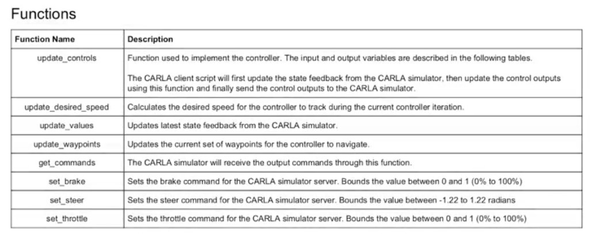
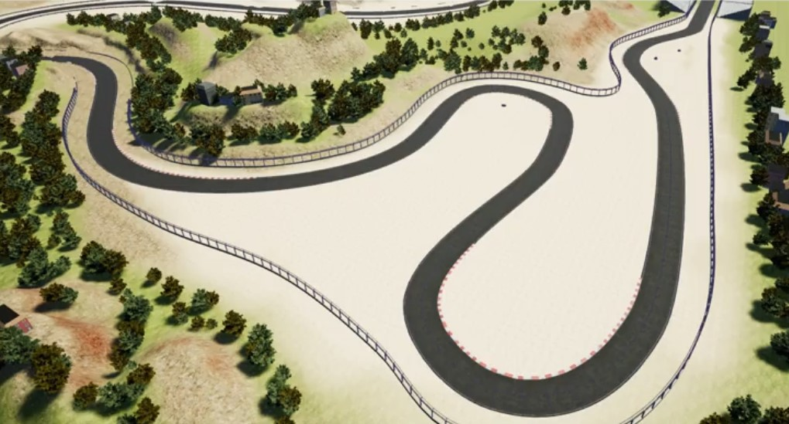
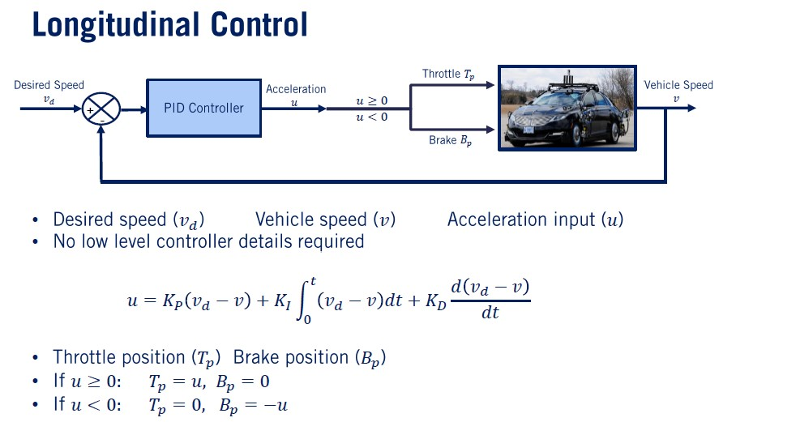
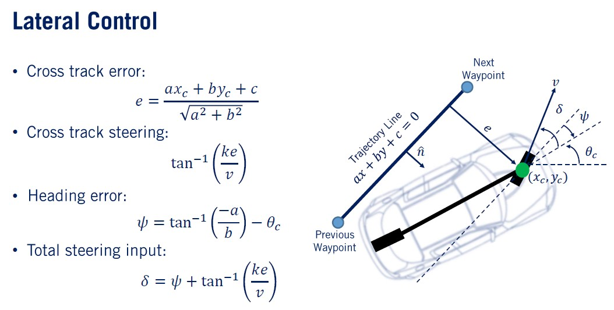
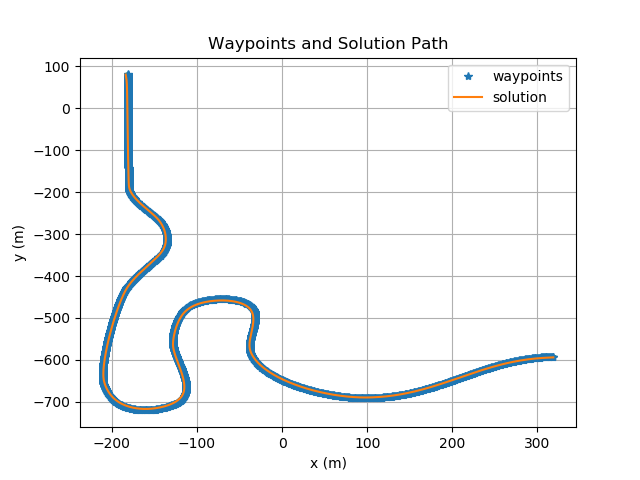
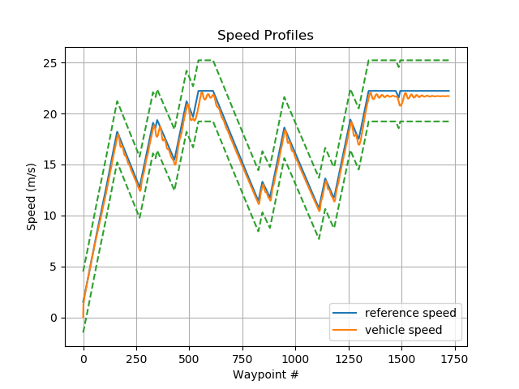
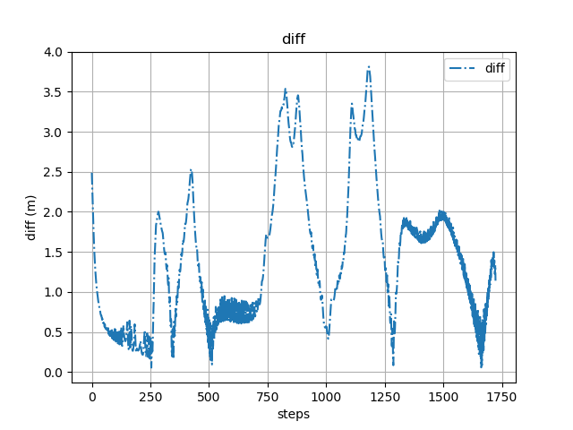

# Self Driving Car Control Design

## Projects Notes
- This project is the starter projects of [Self-Driving Cars Specialization](https://www.coursera.org/specializations/self-driving-cars).

- In this project the waypoints include positions as well as the speed the vehicle should attain. As a result, the waypoints
become the reference signal for controller and navigating to all the waypoints effectively completes the full track.

- Since the controller reference contains both position and speed, we need to implement both __Longitudinal and Lateral Control__.

- The output of the controller will be the vehicle __throttle__, __brake__ and __steering angle__ commands.

## Controller Functions are as the following:

##  The Race Tack including waypoints:

## Conteoller Design Basic Background :

### Longitudinal Control

### Lateral Control

## Results :

### Waypoints Path follower

### Sped profile 

### different distance between waypoint and vehicle path

## Other Important Dependencies

* python >= 3.2
  * All OSes: [click here for installation instructions](https://www.python.org/downloads/)

* Python Libs (using pip install)
  * Pillow>=3.1.2
  * numpy>=1.14.5
  * protobuf>=3.6.0
  * pygame>=1.9.4
  * matplotlib>=2.2.2
  * future>=0.16.0
  * scipy>=0.17.0

* Carla Simulator
  * [click here to download Carla](https://drive.google.com/file/d/1yBelIsGI9M1335dyJP_C071Ys_hzOXwG/view?usp=sharing)

- __Server terminal:__
> `$ cd $HOME /opt/CarlaSimulator      # where the CarlaSimulator is located`

> `$ ./CarlaUE4.sh /Game/Maps/RaceTrack -windowed -carla-server -ResX=640 -ResY=480 -benchmark -fps=20`

- __Client terminal:__
> `$ cd $HOME /opt/CarlaSimulator/PythonClient/Course1FinalProject`

> `$ python3 module_7.py`

### How to run in Windows:

- __Server terminal:__
> `\> C:`

> `\> cd \Coursera\CarlaSimulator`

> `\> CarlaUE4.exe /Game/Maps/RaceTrack -windowed -carla-server -benchmark -fps=15 -ResX=640 -ResY=480`

- __Client terminal:__
> `\> C:`

> `\> cd \Coursera\CarlaSimulator\PythonClient\Course1FinalProject`

> `\> python module_7.py`